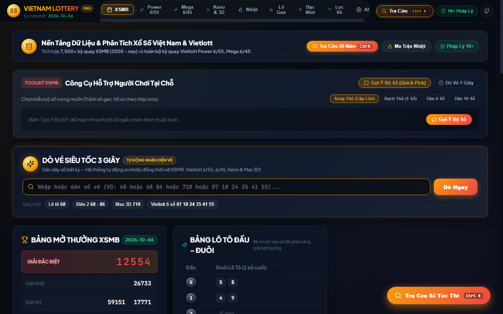
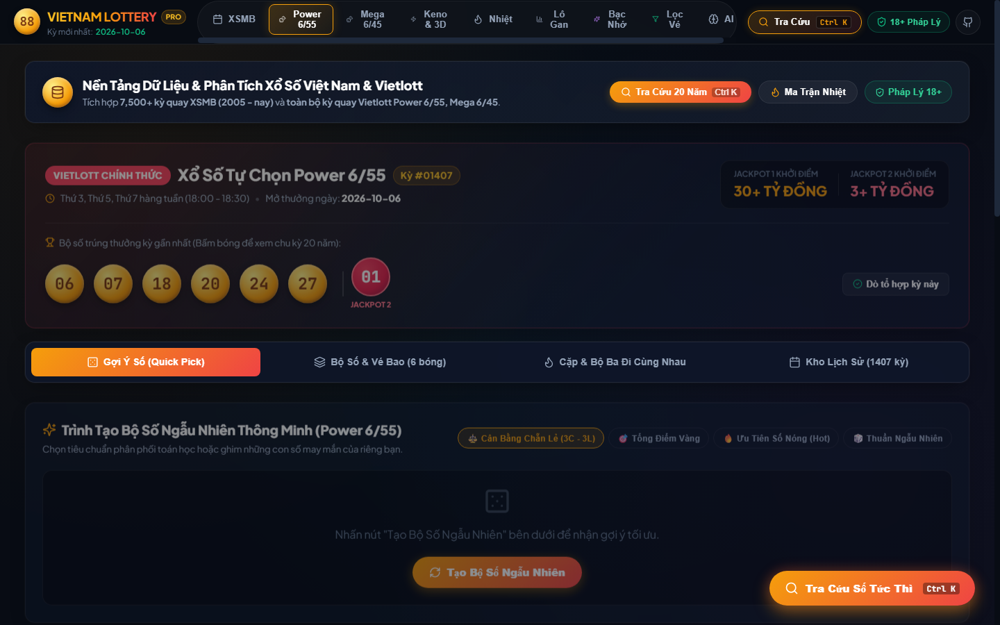
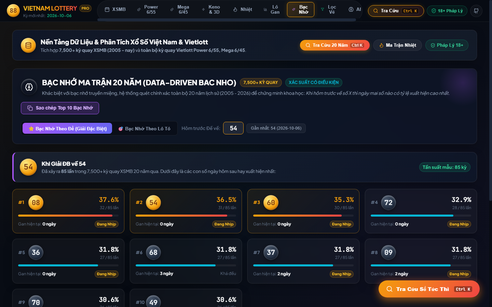
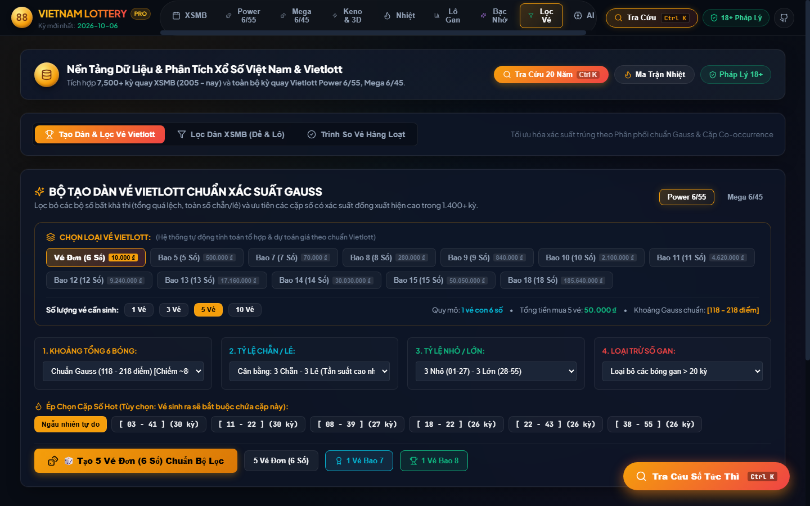
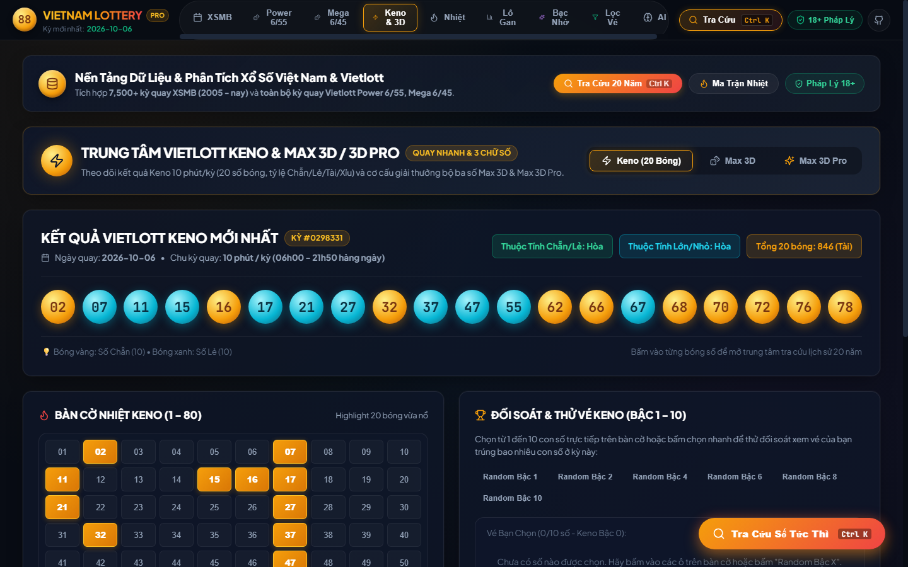
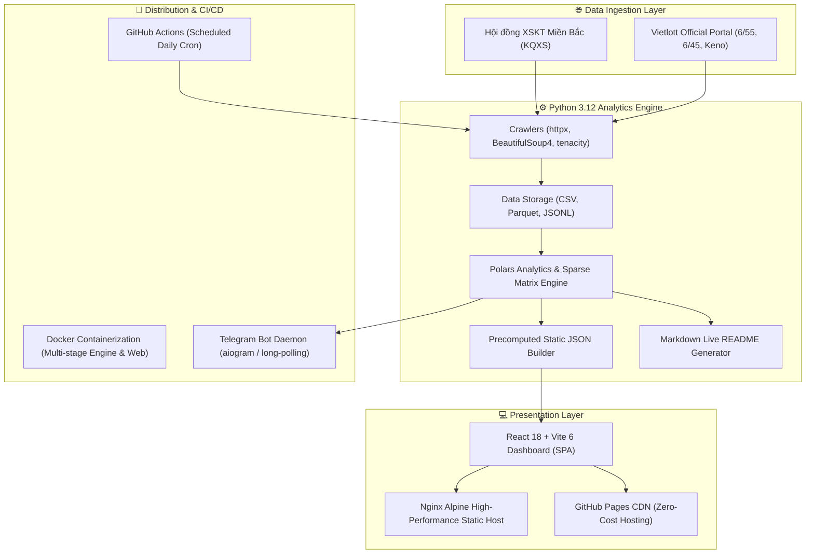

# Vietnam Lottery & Vietlott Analytics Platform (vietnam-lottery-hub)

[](https://github.com/thieucong98/vietnam-lottery-hub/actions/workflows/daily-crawler.yml)
[](https://github.com/thieucong98/vietnam-lottery-hub/actions/workflows/deploy-pages.yml)
[](docker-compose.yml)
[](pyproject.toml)
[](web/)
[](https://opensource.org/licenses/MIT)
[](LEGAL_DISCLAIMER.md)

> 🌐 **Live Web App:** [https://thieucong98.github.io/vietnam-lottery-hub/](https://thieucong98.github.io/vietnam-lottery-hub/)  
> 🔄 **Cập nhật dữ liệu tự động lần cuối:** 10/10/2026 16:15:13 (Giờ Việt Nam)  
> 📊 **Nguồn dữ liệu:** Cào tự động và lưu trữ lịch sử hơn 20 năm (2005 - nay) từ Hội đồng Xổ số Kiến thiết & Vietlott.

---

## 📑 MỤC LỤC
1. [Giới Thiệu Tổng Quan](#-giới-thiệu-tổng-quan)
2. [Hình Ảnh Sản Phẩm (Visual Showcase)](#-hình-ảnh-sản-phẩm-visual-showcase)
3. [Kết Quả Mở Thưởng Mới Nhất](#-kết-quả-mở-thưởng-mới-nhất)
4. [Tính Năng Nổi Bật](#-tính-năng-nổi-bật)
5. [Kiến Trúc Kỹ Thuật (Architecture)](#-kiến-trúc-kỹ-thuật-architecture)
6. [Hướng Dẫn Triển Khai Docker (Khuyên Dùng)](#-hướng-dẫn-triển-khai-docker-khuyên-dùng)
7. [Hướng Dẫn Cài Đặt Cục Bộ (Local Development)](#-hướng-dẫn-cài-đặt-cục-bộ-local-development)
8. [Cấu Hình Biến Môi Trường (.env)](#-cấu-hình-biến-môi-trường-env)
9. [Kiểm Thử & Đảm Bảo Chất Lượng](#-kiểm-thử--đảm-bảo-chất-lượng)
10. [Tuyên Bố Pháp Lý & Chơi Có Trách Nhiệm (18+)](#-tuyên-bố-pháp-lý--chơi-có-trách-nhiệm-18)

---

## 🌟 GIỚI THIỆU TỔNG QUAN

**Vietnam Lottery & Vietlott Analytics Platform** là nền tảng khoa học dữ liệu và phân tích thống kê xổ số toàn diện, hiện đại hàng đầu Việt Nam. Nền tảng được thiết kế với kiến trúc **Data-First, Zero-Backend Serving** (phục vụ người dùng với độ trễ gần bằng 0ms qua static JSON indices và client-side compute), tích hợp công nghệ xử lý dữ liệu lớn bằng **Polars & Python 3.12**, giao diện đồ họa phong cách **Fintech & Data-Dense Dashboard** trên **React 18 & Vite 6**, hỗ trợ đóng gói chuẩn **Docker Multi-Stage** và tự động hóa 100% qua **GitHub Actions CI/CD**.

Hệ thống bao phủ đầy đủ tất cả các loại hình xổ số hợp pháp tại Việt Nam:
* 🔴 **Xổ số Kiến thiết Miền Bắc (XSMB):** Dữ liệu chuỗi thời gian 20 năm (7,500+ kỳ quay liên tục từ 2005 đến nay).
* 🔵 **Vietlott Power 6/55 & Mega 6/45:** Toàn bộ lịch sử từ kỳ mở thưởng đầu tiên, đối soát ma trận tổ hợp tức thì.
* 🟢 **Vietlott Keno & Max 3D / Max 3D Pro:** Theo dõi chuỗi kỳ, ma trận nhiệt và tần suất xuất hiện.

---

## 📸 HÌNH ẢNH SẢN PHẨM (VISUAL SHOWCASE)

Dưới đây là hình ảnh thực tế các module cốt lõi của hệ thống:

### 1. Bảng Mở Thưởng XSMB & Dò Vé Nhanh
Hiển thị trực quan 27 giải mở thưởng chuẩn truyền thống, bảng thống kê Đầu - Đuôi Lô tô thời gian thực, cùng công cụ dò vé 3 giây hỗ trợ phát hiện trúng Giải Đặc Biệt và phân tích tần suất 30 kỳ.



---

### 2. Trung Tâm Vietlott (Power 6/55 & Mega 6/45)
Tích hợp trọn gói: Bộ tạo dàn vé nhanh chuẩn phân phối Gauss (**Quick Pick Pro**), Phân tích Vé Bao (Bao 5 đến Bao 18), Ma trận Cặp số & Bộ ba đồng xuất hiện (**Co-occurrence Analysis**), cùng công cụ mô phỏng chiến lược nuôi vé Backtest PnL trong 1,400+ kỳ quay.



---

### 3. Bạc Nhớ Ma Trận 20 Năm (Data-Driven Bac Nho Engine)
Được huấn luyện trên hơn 7,500 kỳ quay lịch sử (2005 - 2026), thuật toán tính toán xác suất có điều kiện $P(A|B)$ chính xác: khi hôm trước về số X hoặc Đề về Y thì hôm sau số nào có xác suất nổ cao nhất, kết hợp đánh giá nhịp chu kỳ và cảnh báo lô gan.



---

### 4. Bộ Tạo Dàn Vé Gauss & Trình So Vé Hàng Loạt
Bộ lọc dàn số đa tiêu chí (Chạm, Tổng, Chẵn/Lẻ, Lớn/Bé, Kép, loại trừ Lô gan). Trình so vé hàng loạt cho phép dán danh sách 10 đến 64 vé và đối soát ngay lập tức với kỳ quay mới nhất.



---

### 5. Trung Tâm Keno & Bàn Cờ Nhiệt 1-80
Giám sát 20 bóng số Keno mỗi kỳ, Bàn cờ nhiệt phân tích vùng nóng/lạnh 80 số, hỗ trợ thử nghiệm vé Keno Bậc 1 đến Bậc 10 với tỷ lệ trả thưởng chính xác theo quy định Vietlott.



---

## 🏆 KẾT QUẢ MỞ THƯỞNG MỚI NHẤT

### 1. Xổ Số Kiến Thiết Miền Bắc (2026-10-10)

| Xổ Số Kiến Thiết Miền Bắc | Thống Kê Đầu - Đuôi Lô Tô |
| :--- | :--- |
| <table><tr><td><strong>Ngày quay</strong></td><td><strong>2026-10-10</strong></td></tr><tr><td><strong>Giải Đặc Biệt</strong></td><td><strong style="color:#ef4444; font-size:1.2em;">82153</strong></td></tr><tr><td>Giải Nhất</td><td><strong>06534</strong></td></tr><tr><td>Giải Nhì</td><td>63394, 88321</td></tr><tr><td>Giải Ba</td><td>22066, 69267, 14493<br>91244, 29350, 79479</td></tr><tr><td>Giải Tư</td><td>0497, 1563, 3110, 2236</td></tr><tr><td>Giải Năm</td><td>8527, 5178, 3276<br>0222, 0133, 8922</td></tr><tr><td>Giải Sáu</td><td>890, 786, 604</td></tr><tr><td>Giải Bảy</td><td>30, 71, 18, 43</td></tr></table> | <table><tr><th>Đầu</th><th>Đuôi Lô Tô</th></tr><tr><td><strong>0</strong></td><td>4</td></tr><tr><td><strong>1</strong></td><td>0, 8</td></tr><tr><td><strong>2</strong></td><td>1, 2, 2, 7</td></tr><tr><td><strong>3</strong></td><td>0, 3, 4, 6</td></tr><tr><td><strong>4</strong></td><td>3, 4</td></tr><tr><td><strong>5</strong></td><td>0, 3</td></tr><tr><td><strong>6</strong></td><td>3, 6, 7</td></tr><tr><td><strong>7</strong></td><td>1, 6, 8, 9</td></tr><tr><td><strong>8</strong></td><td>6</td></tr><tr><td><strong>9</strong></td><td>0, 3, 4, 7</td></tr></table> |

---

### 2. Vietlott Power 6/55 & Mega 6/45

* **Vietlott Power 6/55 (Kỳ #01407 - Ngày 2026-10-06):**  
  `[06]` `[07]` `[18]` `[20]` `[24]` `[27]` | `★ [01]` (Số Đặc Biệt)

* **Vietlott Mega 6/45 (Kỳ #01571 - Ngày 2026-10-04):**  
  `[15]` `[20]` `[29]` `[37]` `[40]` `[45]`

---

## 🚀 TÍNH NĂNG NỔI BẬT

* ⚡ **Tra Cứu Lịch Sử Siêu Tốc (Zero-Latency Instant Lookup - `Ctrl + K`)**:
  * Tra cứu tức thì lịch sử bất kỳ số nào: XSMB (00-99), Vietlott Power 6/55 (01-55), Mega 6/45 (01-45).
  * Hiển thị ngày đầu tiên xuất hiện (First Seen), kỳ quay gần nhất (Last Seen), tổng số lần về trong 20 năm, số lần trúng Đề.
  * Tra cứu Cặp Lô Xiên (Xiên 2), tần suất xuất hiện cùng nhau, kèm nút xuất file CSV phân tích chi tiết.

* 🧠 **Bạc Nhớ Ma Trận 20 Năm (Data-Driven Bac Nho Engine)**:
  * Thuật toán thống kê xác suất có điều kiện dựa trên ma trận thưa 7,500+ ngày.
  * Dự báo tự động số tiềm năng theo kết quả ngày hôm trước, cảnh báo chu kỳ nhịp nổ vs lô gan.

* 🎯 **Trung Tâm Phân Tích Vietlott Tích Hợp (Power 6/55 & Mega 6/45)**:
  * **Quick Pick Pro:** Tạo dàn vé thông minh chuẩn đường cong phân phối Gauss (tổng điểm 120-180, cân bằng chẵn/lẻ 3-3, tỷ lệ nhỏ/lớn 3-3, ưu tiên cặp số hot).
  * **Vé Bao 5 đến Bao 18:** Hỗ trợ tính toán số tổ hợp, chi phí đầu tư và kiểm tra trúng thưởng đa tầng.
  * **Ma Trận Cặp & Bộ Ba:** Xếp hạng 20 cặp và 20 bộ ba bóng số xuất hiện cùng nhau nhiều nhất trong toàn bộ lịch sử Vietlott.
  * **Backtest PnL Simulator:** Giả lập hiệu quả tài chính nếu nuôi cố định bộ số qua 100 kỳ, 1 năm hoặc toàn bộ lịch sử.

* 🎰 **Trung Tâm Keno & Max 3D**:
  * Bàn cờ nhiệt 80 bóng số, bộ chọn Keno Bậc 1 đến Bậc 10 và bảng tra cứu Max 3D / Max 3D Pro.

* 🤖 **Tự Động Hóa CI/CD & Telegram Bot 2 Chiều**:
  * GitHub Actions tự động cào dữ liệu lúc **18:35** (XSMB) và **18:45** (Vietlott) mỗi ngày, tái tạo chỉ mục và tự động cập nhật README & GitHub Pages.
  * Telegram Bot hỗ trợ tra cứu tương tác 2 chiều: `/xsmb`, `/power`, `/mega`, `/check`, `/gan`, `/bacnho`, `/hot`.

---

## 🏛️ KIẾN TRÚC KỸ THUẬT (ARCHITECTURE)



---

## 🐳 HƯỚNG DẪN TRIỂN KHAI DOCKER (KHUYÊN DÙNG)

Dự án đã được cấu hình sẵn **Docker** và **Docker Compose**, giúp triển khai trên mọi môi trường (Windows, macOS, Linux, Server/VPS) chỉ với 1 câu lệnh duy nhất mà không cần cài đặt Python hay Node.js trên máy host.

### 1. Yêu Cầu Tiên Quyết
* Đã cài đặt [Docker](https://docs.docker.com/get-docker/) và [Docker Compose](https://docs.docker.com/compose/install/) (Docker Desktop trên Windows/macOS hoặc Docker Engine trên Linux).

### 2. Khởi Động Web Dashboard (Cổng 8080)
Khởi động container Nginx Alpine phục vụ Frontend React SPA với hiệu năng tối đa:
```bash
# Clone repository (nếu chưa có)
git clone https://github.com/thieucong98/vietnam-lottery-hub.git
cd vietnam-lottery-hub

# Khởi động dịch vụ web ở chế độ chạy ngầm
docker compose up -d web
```
Sau khi khởi động thành công, mở trình duyệt và truy cập:
👉 **http://localhost:8080**

### 3. Chạy Pipeline Cào Dữ Liệu Qua Docker
Khi muốn cập nhật dữ liệu thủ công bằng container Python Engine:
```bash
docker compose run --rm pipeline
```
Lệnh này sẽ khởi động container Python 3.12, chạy crawler cập nhật kết quả mới nhất, sinh lại ma trận chỉ mục JSON vào thư mục `web/public/data/` và cập nhật lại `README.md`.

### 4. Khởi Động Telegram Bot 2 Chiều Qua Docker
Để chạy Telegram Bot phản hồi tin nhắn tự động 24/7:
```bash
# 1. Tạo file .env từ mẫu
cp .env.example .env

# 2. Mở file .env và điền thông tin Token Bot của bạn
# TELEGRAM_BOT_TOKEN=your_bot_token_here
# TELEGRAM_CHAT_ID=your_chat_id_here

# 3. Khởi động Web cùng Telegram Bot daemon
docker compose --profile bot up -d
```

### 5. Quản Lý Container Docker
```bash
# Xem trạng thái các container
docker compose ps

# Xem log hoạt động
docker compose logs -f web
docker compose logs -f bot

# Dừng tất cả container
docker compose down
```

---

## 💻 HƯỚNG DẪN CÀI ĐẶT CỤC BỘ (LOCAL DEVELOPMENT)

Nếu bạn muốn trực tiếp phát triển, chỉnh sửa mã nguồn hoặc kiểm thử trên môi trường local:

### 1. Yêu Cầu Môi Trường
* **Python:** 3.12 trở lên (Khuyến nghị cài đặt trình quản lý gói siêu tốc [astral-sh/uv](https://docs.astral.sh/uv/)).
* **Node.js:** v18.0 trở lên (Khuyến nghị Node 20 LTS) & npm.

### 2. Cài Đặt & Chạy Python Analytics Engine
```bash
# Cài đặt toàn bộ thư viện cần thiết với uv
uv sync

# Chạy toàn bộ pipeline (cào dữ liệu, xử lý ma trận, tạo chỉ mục, render README)
uv run python scripts/run_pipeline.py

# Hoặc sử dụng CLI riêng biệt
uv run lottery sync-xsmb
uv run lottery sync-vietlott --product all
uv run lottery build-index
```

### 3. Cài Đặt & Khởi Chạy Frontend React
```bash
# Chuyển vào thư mục web
cd web

# Cài đặt dependencies
npm install

# Khởi động máy chủ dev Vite (Hot Module Replacement)
npm run dev
```
Trình duyệt sẽ tự động mở ứng dụng tại địa chỉ: 👉 **http://localhost:5173**

Để tạo bản build sản phẩm tối ưu:
```bash
npm run build
npm run preview
```

### 4. Khởi Chạy Telegram Bot Cục Bộ
```bash
# Cấu hình biến môi trường
cp .env.example .env

# Khởi chạy bot dạng Long Polling
uv run python scripts/run_telegram_bot.py
```

---

## ⚙️ CẤU HÌNH BIẾN MÔI TRƯỜNG (.ENV)

Hệ thống cung cấp file mẫu `.env.example`. Hãy sao chép thành `.env` để cấu hình các tham số vận hành:

```env
# ------------------------------------------------------------------
# Cấu hình Telegram Bot (Tùy chọn - chỉ cần khi chạy bot tương tác)
# ------------------------------------------------------------------
TELEGRAM_BOT_TOKEN=
TELEGRAM_CHAT_ID=

# ------------------------------------------------------------------
# Cấu hình Web & Mạng
# ------------------------------------------------------------------
PORT=8080
HOST=0.0.0.0

# ------------------------------------------------------------------
# Cấu hình Đường dẫn Dữ liệu
# ------------------------------------------------------------------
DATA_DIR=data
WEB_DATA_DIR=web/public/data
```

---

## 🧪 KIỂM THỬ & ĐẢM BẢO CHẤT LƯỢNG

Dự án áp dụng quy trình kiểm thử tự động nghiêm ngặt nhằm đảm bảo độ chính xác tuyệt đối của các thuật toán toán học và tính toàn vẹn của dữ liệu:

```bash
# Chạy toàn bộ Unit Tests & Integration Tests cho Python Engine
uv run pytest

# Kiểm tra cú pháp và định dạng mã nguồn Python
uv run ruff check .

# Kiểm tra TypeScript và Build Frontend
cd web
npm run build
```

---

## ⚖️ TUYÊN BỐ PHÁP LÝ & CHƠI CÓ TRÁCH NHIỆM (18+)

> [!IMPORTANT]
> **Về ranh giới pháp lý tại Việt Nam:**
> 1. **Xổ số Nhà nước là hợp pháp:** Hoạt động phát hành Xổ số kiến thiết truyền thống và Xổ số điện toán Vietlott là ngành nghề kinh doanh có điều kiện, hoàn toàn hợp pháp do Nhà nước cấp phép và quản lý theo **Nghị định 30/2007/NĐ-CP**, **Thông tư 75/2013/TT-BTC** và **Quyết định 1108/QĐ-TTg** của Thủ tướng Chính phủ, nhằm tạo nguồn thu ngân sách xây dựng các công trình y tế, giáo dục và phúc lợi xã hội.
> 2. **Lô đề ngầm là bất hợp pháp:** Các hoạt động cá cược, đánh bạc dưới hình thức "lô đề" tự phát ăn tiền là hành vi vi phạm pháp luật nghiêm trọng, bị xử phạt vi phạm hành chính theo **Nghị định 144/2021/NĐ-CP** hoặc truy cứu trách nhiệm hình sự theo **Điều 321, 322 Bộ luật Hình sự 2015 (sửa đổi, bổ sung 2017)**.

### Mục Đích & Nguyên Tắc Dự Án:
* 🎓 **Nghiên cứu khoa học dữ liệu & học thuật thuần túy:** Dự án được xây dựng phục vụ nghiên cứu xác suất thống kê, mô hình chuỗi thời gian, cấu trúc dữ liệu ma trận thưa và kiến trúc CI/CD tự động hóa mã nguồn mở.
* 🚫 **Nghiêm cấm cờ bạc & lô đề:** Tác giả và cộng đồng phát triển **kiên quyết phản đối và nghiêm cấm** việc sử dụng mã nguồn, dữ liệu, trang web, Telegram Bot hay tài liệu của dự án vào các hoạt động cờ bạc, cá cược, tổ chức đánh bạc hoặc bất kỳ hành vi vi phạm pháp luật nào.
* 🎲 **Bản chất biến cố ngẫu nhiên độc lập:** Về mặt toán học xác suất, mỗi kỳ quay là một biến cố ngẫu nhiên độc lập. Mọi phân tích thống kê chỉ mang tính chất mô tả dữ liệu quá khứ, **KHÔNG CÓ GIÁ TRỊ CAM KẾT** hay bảo đảm bất kỳ kết quả nào trong tương lai.
* 🔞 **Chơi có trách nhiệm (18+):** Người dùng tham gia các trò chơi xổ số hợp pháp phải từ đủ 18 tuổi trở lên. Hãy xem xổ số như một hình thức giải trí lành mạnh đóng góp cho xã hội; tuyệt đối không vay mượn, không dồn vốn và không coi đây là công cụ đầu tư kiếm tiền.

👉 **Đọc toàn văn Chính Sách & Tuyên Bố Pháp Lý Chi Tiết Tại Đây:** [LEGAL_DISCLAIMER.md](LEGAL_DISCLAIMER.md)

---

## 📄 GIẤY PHÉP (LICENSE)

Dự án được phân phối dưới giấy phép **[MIT License](LICENSE)**. Bản quyền © 2025 - 2026 thuộc về **thieucong98** & Vietnam Lottery Hub Contributors.
